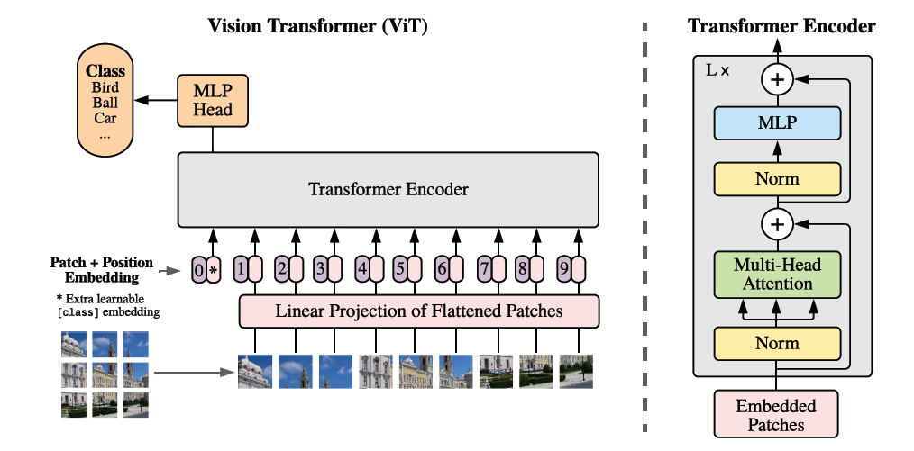

# A Image is Worth 16x16 Words: Transformers for Image Recognition at Scale

> 视觉Transformer的开山之作，将图片分成小的Patch，一定程度上缓解了图像上Self-Attention计算开销过大的问题，并指出了在大规模预训练数然后在小数据集上Fine-tune对于ViT的意义；

**Abstract:**

Reliance on CNN is unnecessary and a pure transformer applied directly to sequences of image patches can perform well on image classification tasks.

## Introduction

Applying a standard Transformer directly to images. 

- Split an image into patches.
- Provide the sequence of linear embeddings of these patches as an input to a Transformer.
- Image patches are treated the same way as tokens (words) in an NLP application.

Mid-sized datasets yield accuracies below ResNet, possibly because Transformers lack inductive biases inherent to CNNs $\rarr$ Don't generalize very well.

## Related Work

Try to scale the attention.

## Method

Follow the original Transformer as much as possible.

### Vision Transformer (ViT)

     
    <caption><b>Figure 1:</b> Overview of ViT</caption>

Steps:

1. Reshape the input image $x \in \R^{H \times W \times C}$ into a  sequence of flattened 2D patches $x_p \in \R^{N \times (P^2\cdot C)}$.
2. Map $x_p$ to $D$ dimensions with a trainable linear projection.
3. Prepend a learnable embedding to the sequence of embedded patches ($z_0^0 = x_{cleass}$), whose state at the output of the Transformer encoder ($z_L^0$) serves as the image representation $y$.
4. Add *trainable* position embeddings to the patch embeddings $\rarr$ Input to the encoder.

The encoder has the following formula:
$$
\begin{array}{l}
z_0  &= [x_{class}; x_p^1E; x_p^2E; \dots; x_p^NE ] + E_{pos}, & E \in \R^{(P^2 \cdot C) \times D}, E_{pos} \in \R^{(N + 1) \times D} & (1)\\
z'_l &= MSA(LN(z_{l-1})) + z_{l-1}, & l = 1, 2, \dots, L & (2)\\
z_l  &= MLP(LN(z'_l)) + z'_l, & l = 1, 2, \dots, L & (3)\\
y    &= LN(z_L^0) & & (4)
\end{array}
$$
**Inductive Bias:**

CNN $\rarr$ locality, two-dimensional neighborhood structure and translation equivariance.

**Hybrid Architecture:**

The input sequence can be formed from feature maps of a CNN.

### Fine-Tuning and Higher Resolution

For higher resolution, keep patch size the same, perform 2D interpolation of the pre-trained position embeddings.

## Experiments

### Setup

### Comparison to State-of-the-Art

### Pre-Training Data Requirements

### Scaling Study

### Inspecting Vision Transformer

### Self-Supervision

## Conclusion

Do not introduce image-specific inductive biases into the architecture apart from the initial patch extraction step.

Try to apply ViT to other computer vision tasks.

Further scaling of ViT.

