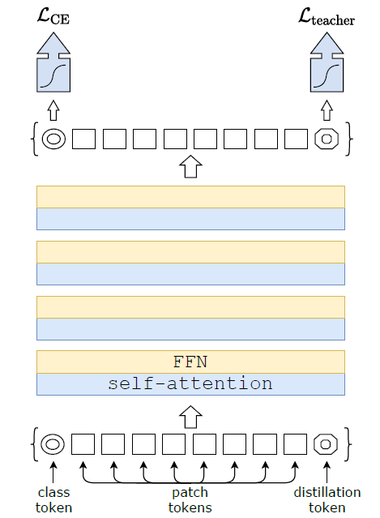
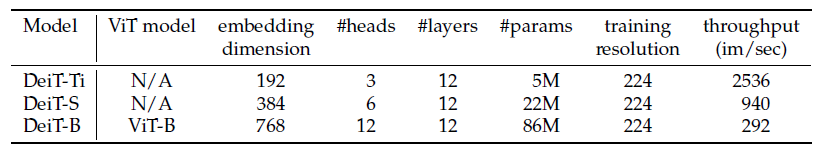

# Training Data-Efficient Image Transformers & Distillation through Attention

> 这是FAIR的一篇工作，目的在于减小Transformer的计算开销，同时介绍了一种针对Transformer的新Teacher-Student策略，可以学习一下如何用相对较少的数据达到良好的效果；

**Abstract:**

Produce competitive convolution-free transformers by training on ImageNet only.

Introduce a teacher-student strategy specific to transformers, which relies on a distillation token ensuring that the student learns from the teacher through attention.

## Introduction

Data-efficient image Transformer, DeiT;

A token-based strategy, advantageously replaces the usual distillation.

Interestingly, with such distillation, image transformers learn more from a ConvNet than from another transformer with comparable performance.

## Related Work

**Knowledge Distillation (KD):** 

the training paradigm in which a *student* model leverages "soft" labels coming from a strong teacher network. This is the output vector of the teacher's softmax function rather than just the maximum of scores, which gives a "hard" label.

It can be regarded as a form of compression of the teacher model into a smaller student model.

## Vision Transformer: Overview

**Multi-head Self Attention layers (MSA):**
$$
\text{Attention}(Q, K, V) = \text{Softmax}(QK^\top/\sqrt d) V,
$$
In self-attention, query, key, and values matrices are themselves computed from a sequence of $N$ input vectors using linear transformations.

In multi-head self-attention (MSA), $h$ self-attention functions are applied to the input.

**Transformer block for images:**

- Add a Feed-Forward Network (FFN) on top of the MSA layer.
- FFN is composed of two linear layers separated by a GeLU activation.
- Both MSA and FFN are operating as residual operators and with a layer normalization.

Add positional embeddings.

**The class token:**

A trainable vector, appended to the patch tokens before the first layer, that goes through the transformer layers, and is then projected with a linear layer to predict the class.

Only the class vector is used to predict the output, which forces the self-attention to spread information between the patch tokens and the class token.

**Fixing the positional encoding across resolutions:**

Interpolate the positional encoding when changing the resolution.

## Distillation through Attention

Assume we have access to a strong image classifier as a teacher model.

**Soft distillation:**

Minimizes the Kullback-Leibler divergence between the softmax of the teacher and the softmax of the student model. The distillation objective is:
$$
\mathcal{L}_{global} = (1 - \lambda) \mathcal{L}_{CE}(\psi(Z_s), y) + \lambda \tau^2 KL(\psi (Z_s / \tau), \psi(Z_t / \tau)).
$$
**Hard-label distillation:**

Take the hard decision of the teacher as a true label. Let $y_t = \arg \max_c Z_t(c)$ be the hard decision of the teacher, the objective is:
$$
\mathcal{L}_{global}^{hard} = \frac{1}{2} \mathcal{L}_{CE} (\psi(Z_s), y) + \frac{1}{2} \mathcal{L}_{CE} ( \psi (Z_s), y_t)
$$
Parameter-free and conceptually simpler.

**Distillation token:**

     
    <caption><b>Figure 1:</b> Distillation Procedure</caption>

Add a new token, the distillation token, to the initial embeddings. The distillation embedding allows our model to learn from the output of the teacher, while remaining complementary to the class embedding.

**Fine-tuning with distillation:**

**Classification with our approach:**

## Experiments 

### Transformer Models

     
    <caption><b>Figure 2:</b> DeiT Variants</caption>

### Distillation

### Efficiency vs. Accuracy

### Transfer Learning

## Training Details & Ablation

## Conclusion

DeiT, image transformers that do not require very large amount of data to be trained, thanks to improved training and in particular a novel distillation procedure.

It's likely that research on data-augmentation more adapted or learned for transformers will bring further gains.