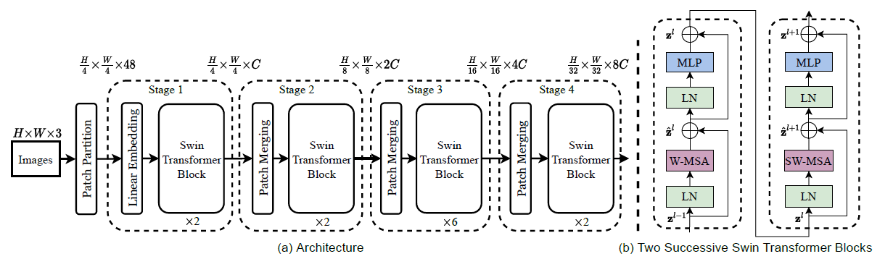
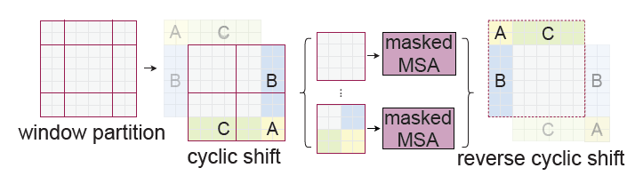

# Swin Transformer: Hierarchical Vision Transformer using Shifted Windows

> 终于到了微软亚洲研究院鼎鼎有名的Swin Transformer，主要的想法是在局部做self-attention，然后不同的局部之间通过shifted window传递信息，这样保证了算法的复杂度在稠密的视觉任务中可以接受。

**Abstract:**

A new vision Transformer, Swin Transformer, that capably serves as a general-purpose backbone for computer vision.

A hierarchical Transformer whose representation is computed with Shifted windows.

The shifted winowing scheme brings greater efficiency by limiting self-attention computation to non-overlapping local windows while allowing for cross-window connection.

## Introduction

Transformer is notable for its use of attention to model long-range dependencies in the data.

Seek to expand the applicability of Transformer such that it can serve as a general-purpose backbone for computer vision.

Difficulties in vision transformer: 

- Scale. Visual elements can vary substantially in scale. Object detection.
- Higher resolution of pixels in images.

Constructs hierarchical feature maps and has linear computational complexity to image size.

A key design element of Swin Transformer is its *shift* of the window partition between consecutive self-attention layers.

## Related Work

**CNN and variants:**

**Self-attention based backbone architectures:**

Some work compute self-attention within a local window of each pixel.

**Self-attention/Transformers to complement CNNs:**

Augment a standard CNN architecture with self-attention layers or Transformers.

**Transformer based vision backbones:**

ViT's architecture is unsuitable for use as a general-purpose backbone network on dense vision tasks or when the input image resolution is high.

## Method

### Overall Architecture

     
    <caption><b>Figure 1:</b> Swin Transformer Architecture Overview</caption>

Steps:

1. First split an input RGB image into non-overlapping patches by a patch splitting module. Each patch is treated as a "token" and its feature is set as a concatenation of the raw pixel RGB values.
2. A linear mebedding layer is applied on this raw-valued feature to project it to an arbitrary dimension, denoted as $C$.
3. Several Transformer blocks with modified self-attention computation, *Swin Transformer blocks*, are applied on these patch token.
   1. The origin patch size is $4 \times 4$, so the first transformer block maintain the number of tokens $H/4 \times W/4$, and together with the linear embedding referred to as "Stage 1".
   2. The number of patches is reduced by patch merging layers. The first patch merging layer concatenates the featrues of each group of $2 \times 2$ neighboring patches and applies a linear layer on the $4C$-dimensional concatenated features to produce a $2C$ dimension output.

**Swin Transformer block:**

Built by replacing the standard multi-head self attention module in a Transformer block by a module based on shifted windows, with other layers kept the same.

### Shifted Window based Self-Attention

Global self-attention, where the relationships between a token and all other tokens are computed, leads to quadratic complexity with respect to the number of tokens.

**Self-attention in non-overlapped windows:**

Propose to compute self-attention within local windows.

The window-based self-attention is scalable.

**Shifted window partition in successive blocks:**

To introduce cross-window connections while maintaining the efficient computation of non-overlappign windows, we propose a *shifted window partitioning approach*

- Regular window partitioning strategy: start from top-left pixel;
- Shfited window partitioning strategy: displacing the windows by $(\lfloor M/2\rfloor, \lfloor M/2\rfloor)$;

**Efficient batch computation for shifted configuration:**

After shifting, there will be more patches on the border of the feature map, we choose a way to efficiently compute self-attention under such circumstance.

     
    <caption><b>Figure 2:</b> Efficient Batch Computaion for Shifted Window</caption>

After shift, a batched window may be composed of several sub-windows that are not adjacent in the feature map, so a masking mechanism is employed to limit self-attention to within each sub-window.

**Relative position bias:**

Introduce a relative position bias $B \in \R^{M^2 \times M^2}$ to each head in computing similarity:
$$
\text{Attention}(Q, K, V) = \text{Softmax} (QK^\top / \sqrt{d} + B) V,
$$
A smaller-sized bias matrix $\hat{B} \in \R^{(2M - 1) \times (2M - 1)}$ and values in $B$ are taken from $\hat{B}$.

The learnt relative position bias in pre-training can be also used to initialize a model for fine-tuning with a different window size through bi-cubic interpolation.

### Architecture Variants

Siwn-T, Swin-S, Swin-B, Swin-L;

## Experiments

### Image Classification on ImageNet-1K

### Object Detection on COCO

### Semantic Segmentation on ADE20K

### Ablation Study

## Conclusion

Swin Transformer, a new vision Transformer wich iproduces a hierarchical feature representation and has linear computational complexity with respect to input image size.

*Shifted window* based self-attention.