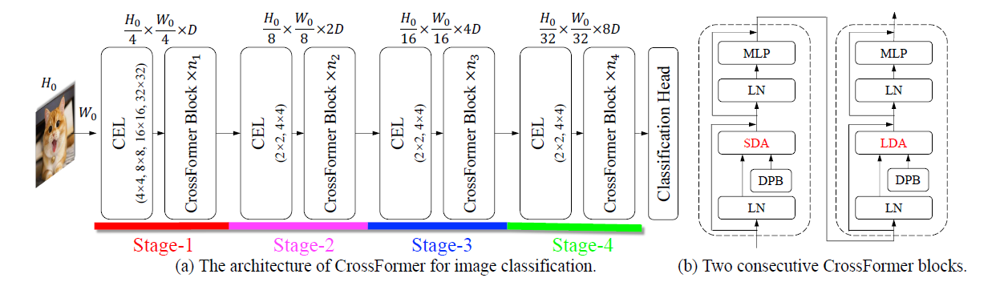
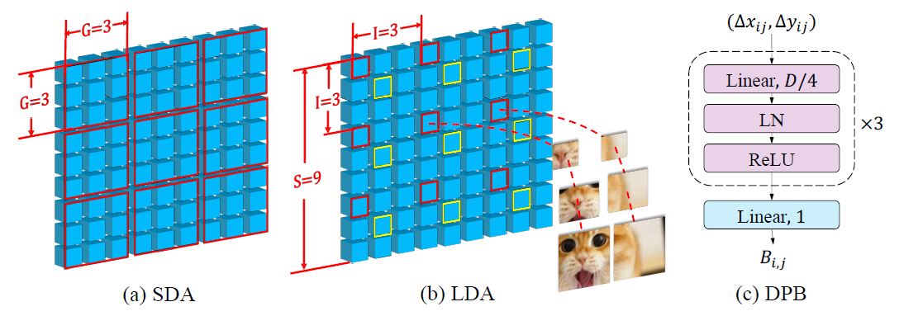

# CrossFormer: A Versatile Vision Transformer Hinging on Cross-Scale Attention

> 这是浙大与腾讯合作的一篇文章。

**Abstract:**

Existing vision transformers have not yet possessed the ability of building the interactions among features of different scales. 

Contributions:

- CEL;
- LSDA;
- DPB;

## Introduction

Recently proposed vision transformers develop multiple substitutes to approximate the vanilla self-attention module with a lower cost.

ViTs do not explicitly utilize features of different scales, whereas multi-scale features are very vital for a lot of vision tasks. Reasons:

- The embeddings are generated from equal-sized patches.
- Adjacent embeddings are often grouped together and merged.

Introduce a trainable module called *Dynamic Position Bias* (DPB), which receives two embeddings' relative distance as input and outputs their position bias.

## Background

**Vision Transformers:**

**Cross-scale Feature Extraction:**

**Sparse Self-attention:**

**Position Representation:**

## CrossFormer

     
    <caption><b>Figure 1:</b> CrossFormer Overview</caption>

CrossFormer employs a pytamid structure, **4** stages $\rarr$ Each stage consists of a CEL and several CrossFormer blocks.

- A CEL receives last stage's output as input and generates cross-scale embeddings. Reduce the number of embeddings to a quarter while doubles their dimensions for a pyramid structure.
- Several CrossFormer blocks (LSDA + DPB) are set up after CEL.

### Cross-Scale Embedding Layer (CEL)

To generate input embeddings for each stage. Take the first stage as an example:

- Sample patches using four kernels of different sizes.
- The stride of four kernels is kept the same, soi the number of generated embeddings is same.
- All these four patches will be projected and concatenated as one embedding.
- In practice, the process of sampling and projecting can be fulfilled through four convolutional layers.

Set the number of output dimensions to control compute budget.

### CrossFormer Block

     
    <caption><b>Figure 2:</b> CrossFormer Blocks</caption>

#### Long Short Distance Attention (LSDA)

Two parts: SDA, LDA;

- For SDA, every $G \times G$ adjacent embeddings are grouped together.
- For LDA with input size $S \times S$, the embeddings are sampled with a fixed interval $I$. The group's height or width for LDA is computed as $G = S / I$.
- After gtoup embeddings, both SDA and LDA employ the vanilla self-attention within each group.

#### Dynamic Position Bias (DPB)

Propose an MLP-based module called DPB to generate the relative position bias dynamically,
$$
\bold{B}_{i, j} = \text{DPB}(\Delta x_{ij}, \Delta y_{ij})
$$
When image/group size is fixed, DPB is equivalent to RPB.

#### Variants of CrossFormer

Group size or the interval does not affect the shape of weight tensors, so the backbones pre-trained on Image Net can be readily fine-tuned on other tasks.

## Experiments

### Image Classification

The batch size is 1024 split on 8 V100 GPUs.

### Object Detection and Instance Segmentation

### Semantic Segmentation

### Ablation Studies

## Conclusions

A novel transformer-based vision architecture, namely CrossFormer.

CEL and LSDA are together essential for dense prediction tasks.